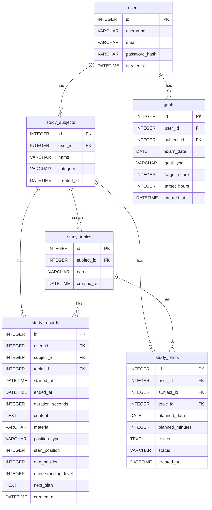

# 🗄️ ② DB設計.md

こっちはちょっと技術寄り。

```markdown
# 学習管理アプリ DB設計

## 1. データベース概要

学習管理アプリで使用するデータを管理する。

ユーザーごとに学習対象・分野・学習記録・学習予定・目標を管理し、ダッシュボードや学習分析に利用する。

使用するデータベースはSQLiteを予定している。

---

## 2. テーブル一覧

| テーブル名 | 内容 |
|---|---|
| users | ユーザー情報 |
| study_subjects | 学習対象 |
| study_topics | 学習分野 |
| study_records | 実際に行った学習記録 |
| study_plans | これから行う学習予定 |
| goals | 学習目標 |

---

## 3. users

ユーザー情報を管理する。

| カラム | 型 | 制約 | 内容 |
|---|---|---|---|
| id | INTEGER | PK | ユーザーID |
| username | VARCHAR | NOT NULL | ユーザー名 |
| email | VARCHAR | UNIQUE, NOT NULL | メールアドレス |
| password_hash | VARCHAR | NOT NULL | ハッシュ化したパスワード |
| created_at | DATETIME | NOT NULL | 登録日時 |

---

## 4. study_subjects

ユーザーが学習している対象を管理する。

例：応用情報、AWS、TOEIC、Java、Pythonなど。

| カラム | 型 | 制約 | 内容 |
|---|---|---|---|
| id | INTEGER | PK | 学習対象ID |
| user_id | INTEGER | FK, NOT NULL | ユーザーID |
| name | VARCHAR | NOT NULL | 学習対象名 |
| category | VARCHAR | NOT NULL | 資格・学校・その他 |
| created_at | DATETIME | NOT NULL | 登録日時 |

### category

- qualification：資格
- school：学校
- other：その他

---

## 5. study_topics

学習対象ごとの分野を管理する。

例：応用情報 → データベース、ネットワーク、セキュリティなど。

| カラム | 型 | 制約 | 内容 |
|---|---|---|---|
| id | INTEGER | PK | 分野ID |
| subject_id | INTEGER | FK, NOT NULL | 学習対象ID |
| name | VARCHAR | NOT NULL | 分野名 |
| created_at | DATETIME | NOT NULL | 登録日時 |

---

## 6. study_records

実際に行った学習を記録する。

このテーブルは本アプリの中心となるテーブルである。

| カラム | 型 | 制約 | 内容 |
|---|---|---|---|
| id | INTEGER | PK | 学習記録ID |
| user_id | INTEGER | FK, NOT NULL | ユーザーID |
| subject_id | INTEGER | FK, NOT NULL | 学習対象ID |
| topic_id | INTEGER | FK, NOT NULL | 分野ID |
| started_at | DATETIME | NULL | 学習開始日時 |
| ended_at | DATETIME | NULL | 学習終了日時 |
| duration_seconds | INTEGER | NOT NULL | 学習時間（秒） |
| content | TEXT | NOT NULL | 勉強した内容 |
| material | VARCHAR | NULL | 教材名 |
| position_type | VARCHAR | NULL | page / question |
| start_position | INTEGER | NULL | 開始ページ・問題番号 |
| end_position | INTEGER | NULL | 終了ページ・問題番号 |
| understanding_level | INTEGER | NULL | 理解度（1～5） |
| next_plan | TEXT | NULL | 次回やること |
| created_at | DATETIME | NOT NULL | 記録作成日時 |

### position_type

- page：ページ番号
- question：問題番号

### understanding_level

- 1：ほぼ分からない
- 2：少し分かる
- 3：普通
- 4：だいたい分かる
- 5：ほぼ完璧

### duration_secondsについて

学習時間は秒単位で保存し、画面上では「○時間○分」の形式に変換して表示する。

---

## 7. study_plans

これから行う学習予定を管理する。

ダッシュボードの「今日やること」に利用する。

| カラム | 型 | 制約 | 内容 |
|---|---|---|---|
| id | INTEGER | PK | 予定ID |
| user_id | INTEGER | FK, NOT NULL | ユーザーID |
| subject_id | INTEGER | FK, NOT NULL | 学習対象ID |
| topic_id | INTEGER | FK, NOT NULL | 分野ID |
| planned_date | DATE | NOT NULL | 学習予定日 |
| planned_minutes | INTEGER | NOT NULL | 予定学習時間（分） |
| content | TEXT | NOT NULL | やること |
| status | VARCHAR | NOT NULL | 予定・完了・キャンセル |
| created_at | DATETIME | NOT NULL | 作成日時 |

### status

- planned：予定
- completed：完了
- cancelled：キャンセル

---

## 8. goals

学習対象ごとの目標を管理する。

| カラム | 型 | 制約 | 内容 |
|---|---|---|---|
| id | INTEGER | PK | 目標ID |
| user_id | INTEGER | FK, NOT NULL | ユーザーID |
| subject_id | INTEGER | FK, NOT NULL | 学習対象ID |
| exam_date | DATE | NULL | 試験日 |
| goal_type | VARCHAR | NOT NULL | 目標種類 |
| target_score | INTEGER | NULL | 目標点 |
| target_hours | INTEGER | NULL | 目標学習時間 |
| created_at | DATETIME | NOT NULL | 作成日時 |

### goal_type

- pass：合格
- score：得点
- hours：学習時間

---

## 9. テーブル間の関係

```text
users
  │
  │ 1:N
  ↓
study_subjects
  │
  │ 1:N
  ↓
study_topics
  │
  ├──────────────┐
  │              │
  ↓              ↓
study_records  study_plans

users
  │
  └──────────────→ goals



